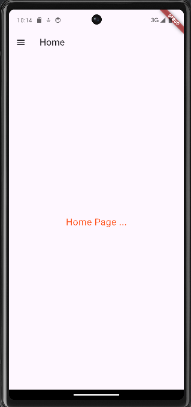
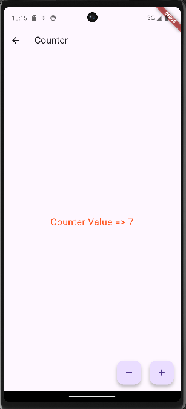
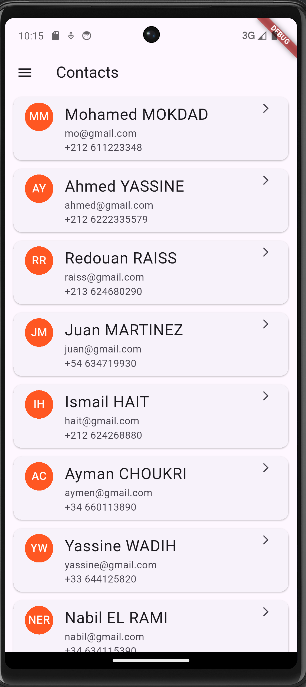
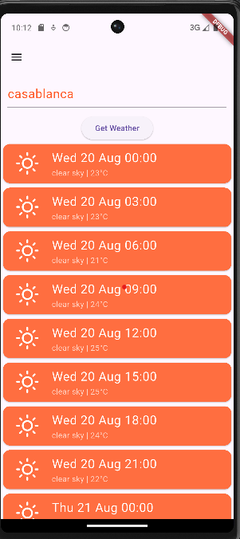
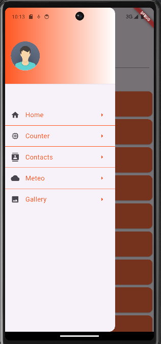

# 📱 Flutter Demo App 2 – Mobile UI Showcase

---
flutter_demo_app_2 est une application mobile développée avec Flutter et Dart, conçue pour démontrer les concepts clés de Flutter et servir de base pour le développement multiplateforme. Ce projet inclut le module Android configuré avec Gradle et Kotlin, et peut être exécuté sur émulateurs Android ainsi que sur Windows.

---

## 🧩 Features

- 🚀 Navigation Drawer (menu latéral)
- 🔢 Counter Page (état dynamique)
- 📇 Contacts Page (liste de contacts simulée)
- ☁️ Weather Page (intégration API OpenWeather)
- 🖼️ Gallery Page (grille d’images locales)
- 📱 Compatible avec émulateur et appareil réel

---

## 📸 Screenshots

<table>
  <tr>
    <td></td>
    <td></td>
    <td></td>
    <td></td>
    <td></td>
    <td></td>
  </tr>
  <tr>
    <td align="center"><b>Drawer Menu</b></td>
    <td align="center"><b>Home Page</b></td>
    <td align="center"><b>Counter</b></td>
    <td align="center"><b>Contacts</b></td>
    <td align="center"><b>Weather</b></td>
    <td align="center"><b>Gallery</b></td>
  </tr>
</table>

---

## 🛠️ How to Run

1. Clone the repo
   ```bash
   git clone https://github.com/MOKDAD2107/flutter_demo_app_2.git
   cd demo_app_2
   ```

2. Install dependencies
   ```bash
   flutter pub get
   ```

3. Run the app
   ```bash
   flutter run
   ```

> 📝 Make sure to add your `.env` file with the correct `OPENWEATHER_API_KEY`.

---


---

